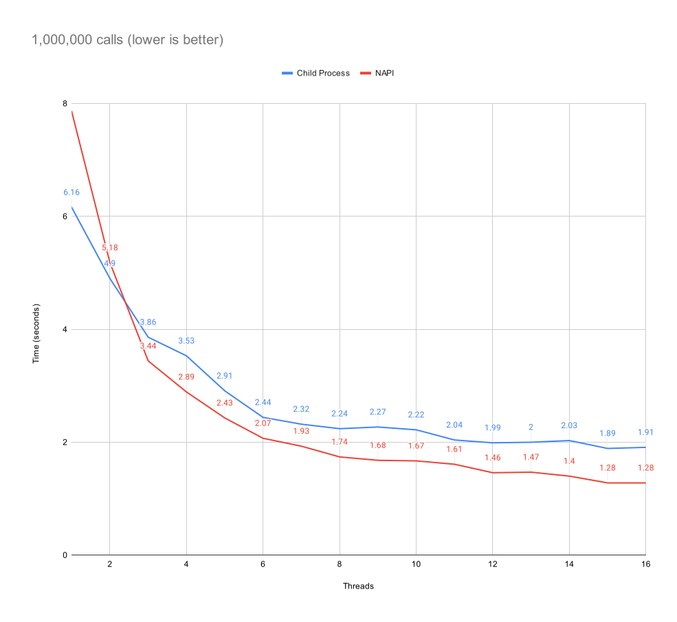
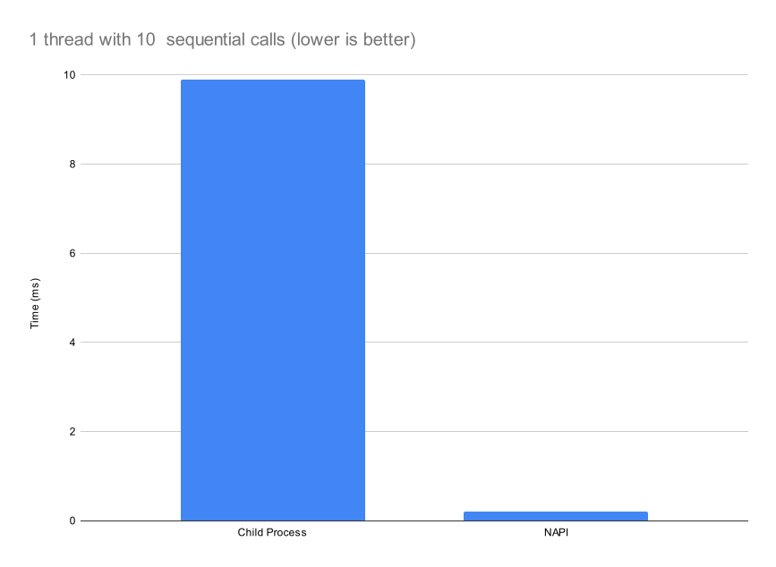

# NAPI Approach

```
cd ./napi
yarn install
yarn build-release

node ./lib/index.js
```

# Child Process Approach

```
cd ./child_process_async
cargo build --release

./target/release/child_process
```

# Benchmarks

**Hardware**
- AMD 7950x (16 cores)
- 98Gb RAM
- Fedora 39



The NAPI approach runs the callback function synchronously (couldn't figure out how to use promises with Neon) while the child process approach batches 50k requests to the child process at a time.

In a real world scenario, it's more likely to see smaller batches of requests making the end result more sensitive to message latency likely leading to worse performance for the child process approach.

We can try to evaluate that by looking at 1 thread making 100 calls sequentially, the napi approach is ~10x faster.


